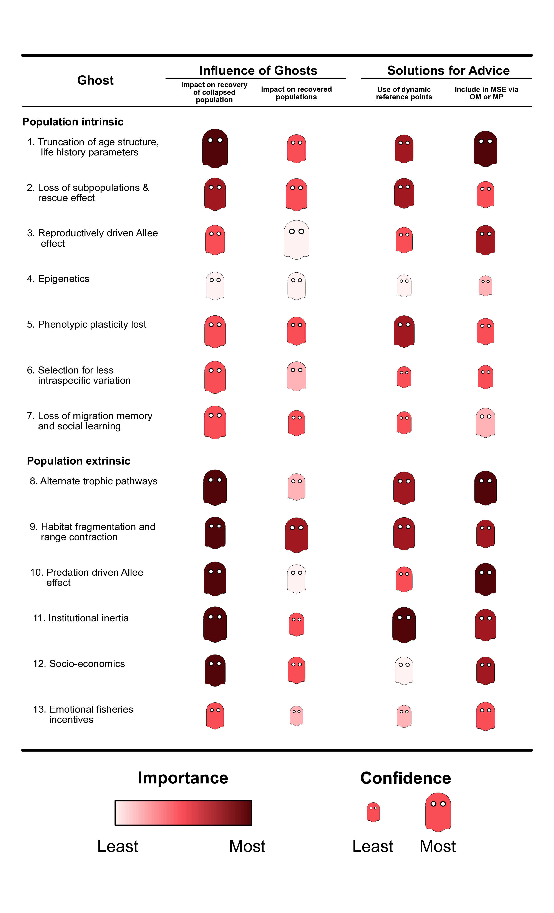
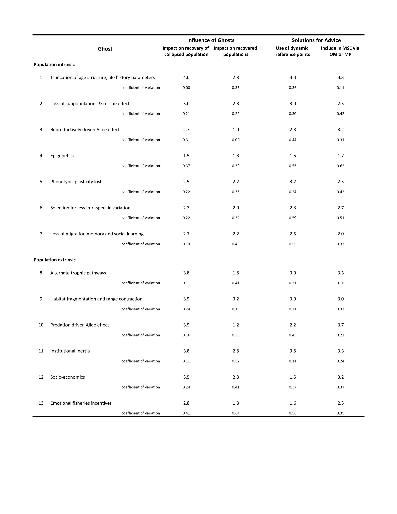

```{r setup, include=FALSE}
knitr::opts_chunk$set(echo = TRUE)
```

## Extra material on the Ghosts of Overfishing Past

**Abstract from the publication**

*Daniel E Duplisea, Tyler D Eddy, Matthew D Robertson, Raquel Ruiz-Díaz, C Abraham Solberg, Fan Zhang. 2025. The ghosts of overfishing past that haunt present day fisheries management. Canadian Journal of Fisheries and Aquatic Sciences. dx.doi.org/10.1139/cjfas-2024-0295*

Fish biomass is the most widely used indicator of fish stock health. Stocks whose biomass is or has previously collapsed owing to overfishing, and the management systems built around them, may carry a memory of decline, even if biomass has recovered. This is because stock biomass as the main indicator of stock health does not represent all aspects of stock health and biomass can possibly become a weaker indicator of health after stock collapse. These latent weaknesses have been termed “ghosts of overfishing past”. Not accounting for ghosts can impact the speed of stock recovery and susceptibility to further collapses. This concept has been popularised by Professors Jeff Hutchings, Anna Kuparinen, and others. Ghosts are varied and can include changes in vital rates, phenotypic response, fish behaviour, and aspects of the human system such as institutional inertia, fisheries subsidies and income portfolios. The presence of ghosts has implications for fisheries management: altering stock biomass objectives (dynamic reference points) may be appropriate for populations that have experienced collapse even if biomass has recovered. Ghosts should be considered when developing management strategies for populations that have previously experienced large declines.

## Scoring the importance of ghosts methodology

In an attempt to rank the importance of the different ghosts of overfishing past described here, each of the six authors independently provided a score from 1 (least influence) to 4 based on our review of the literature (Appendix 1). These results are rankings of the influence of each ghost considered independently, while we acknowledge that several ghosts could be present at any one time, and their relative influences might also change with stock state and also with a greater sample size in scoring.

We classified the ghosts by: their influence on rate of or potential for recovery of collapsed stocks and their influence on recovered populations. We have also assessed how the impact of ghosts could be accounted for in fisheries management: by changing reference points to account for the presence of a ghost or by including a ghost hypothesis in simulation testing for effectiveness of management procedures. The ghosts have been roughly divided into population intrinsic and extrinsic. Intrinsic ghosts are either present within individuals of a population (genetics, institutional inertia) or within collective population rates or characteristics (mean age at maturity). Meanwhile, extrinsic ghosts are present within the broader socio-ecological ecosystem, including the environment (e.g., physical oceanography), biological community, and socio-economic/fisheries management system.


## Results: the relative importance of ghosts

Our synthesis suggests that the ghosts of overfishing past affect recovery of collapsed stocks more than susceptibility to decline of stocks which have recovered from past overfishing (Table 1). The change in life history parameters that arises from truncated age and size structure of populations is the most important ghost influencing recovery and also the ghost with the least variation. Habitat destruction and fragmentation was considered the most important ghost affecting susceptibility of recovered populations to another collapse. The influence of emotional attachment to fisheries was the most variable, suggesting that its role in affecting fishery sustainability is not well known. The role of extrinsic human factors such as socio-economics are also not well understood in sustainability and susceptibility of exploited populations. What is clear is that there are potentially more ghosts that affect recovery of population biomass, many of which could occur simultaneously, than there are that linger after population biomass has recovered.






